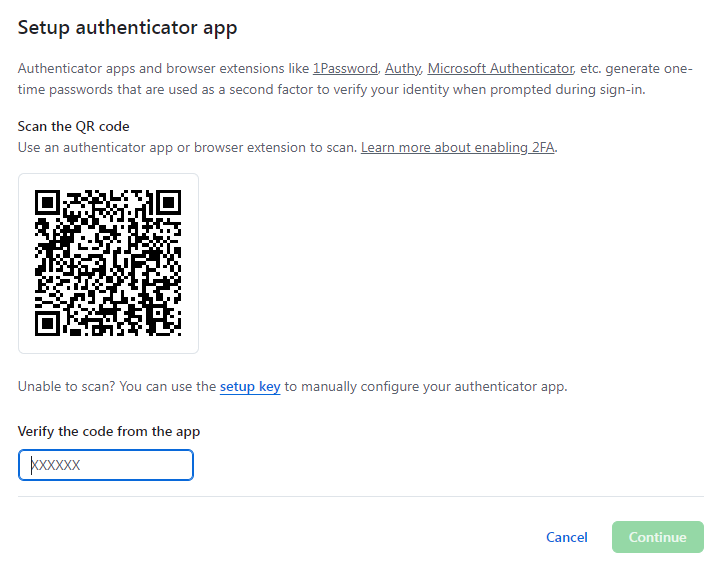
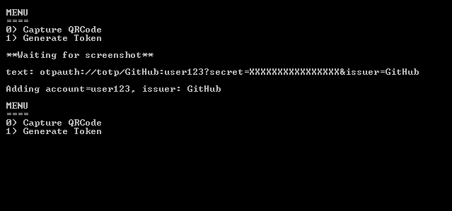
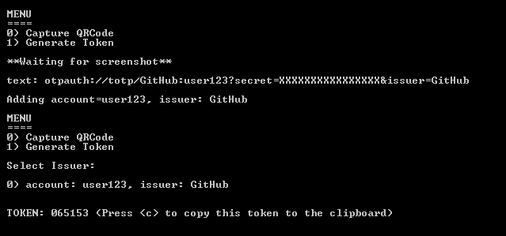

# github-2fa-helper

Starting Sep 16, 2024, Github is forcing *most* users to use 2FA with their accounts.
As some people like me either don't like to be dependent on a third-party app to generate the login tokens or simply don't have a mobile device, I decided to write this little command-line tool.
### Features

- Capture the inital QR code containing the secret key via the System's clipboard
- Generate tokens
- Should work not-only with github - though that is untested
- Store up to 10 accounts locally

### Requirements

- Node.js 18+
- Java 8+, though I'd recommend OpenJDK 17+

### Installation

`git clone https://github.com/scanline/github-2fa-helper`

### Set up

As Node.js offers no way to watch the user's system clipboard, we need to use a little java helper tool which has to be compiled first.

`npm run build`

Afterwards install the dependencies.

`npm install`

### Usage

If you visit [https://github.com/settings/security](https://github.com/settings/security) and select **Enable two-factor authentication** you'll see a screen like this:

Time to start the tool! Head to the installation folder and enter:

`npm start`

which will bring you the following menu:

Press **0** on your keyboard, head back to the github page making sure the QR code is visible and hit the print-screen key.

That's it!

To actually generate a token, push **1** and press the corresponding number for your desired account e.g. **0** in this case.

The token will refresh itself, usually every 30 seconds and pressing **c** will copy it to the clipboard. You can go back to a previous menu or quit the tool by pressing the **escape** key.

### Important Notes
The time you set up 2FA for github, you will also get a list of recovery codes. **Make sure to download those!**

For convenience, this tool saves the secret chained to a particular issuer in a file called *settings.json* inside the tool's folder. **Don't ever delete or modify this file or you will lose access to your account(s)!**

Better make a backup regularly or even modify the code to store it somewhere else on your harddrive.

**I'm not responsible for lost access - you use this tool at your own risk!**